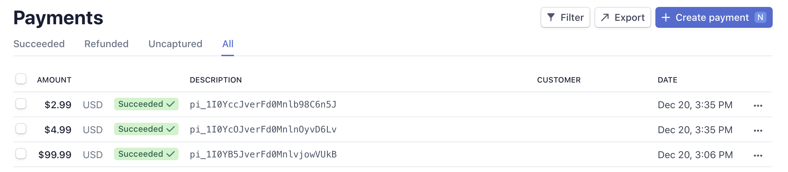

# stripe_demo_til
A flutter application that handle payments with credit cards using Stripe API and Google Cloud Functions.

Test Cards: https://stripe.com/docs/testing

# Author
Til Bahadur Baniya

# Screenshot

 There's a longer demo video inside the demo directory above.

## Getting Started

This project is a starting point for a Flutter application.

A few resources to get you started if this is your first Flutter project:

- [Lab: Write your first Flutter app](https://flutter.dev/docs/get-started/codelab)
- [Cookbook: Useful Flutter samples](https://flutter.dev/docs/cookbook)

For help getting started with Flutter, view our
[online documentation](https://flutter.dev/docs), which offers tutorials,
samples, guidance on mobile development, and a full API reference.
